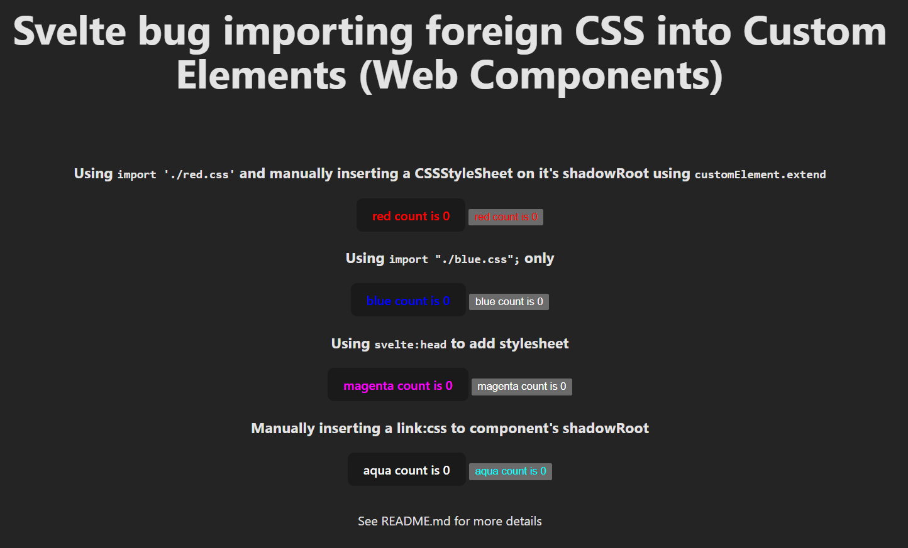

# svelte-css-imports-custom-element-demo

This project demonstrates an issue with Svelte when importing custom CSS into components used as custom elements (Web Components).

## How to use it

1. Install dependencies:
   ```sh
   pnpm install
   ```
2. Run the app:
   ```sh
   pnpm dev
   ```
3. Open `http://localhost:5173` in your browser.

You will see the Svelte Vite template with four counter components: Red, Blue, Magenta, and Aqua.

Each counter imports or injects a custom CSS file (`red.css`, `blue.css`, `magenta.css`, `aqua.css`) and is instantiated in two ways: as a regular Svelte component and as a custom element (Web Component).

- **RedCounter**: Imports `red.css` and uses the `customElement.extend` option to manually create a `CSSStyleSheet` and insert it into the `shadowRoot` of the `<red-counter>` custom element.
- **BlueCounter**: Imports `blue.css` only, relying on Svelte's default handling.
- **MagentaCounter**: Uses `<svelte:head>` to add a global `<link rel="stylesheet" href="/magenta.css" />`, so the style is available globally.
	- This also should have worked, but Svelte is adding the link to the document's head instead of the custom element's ShadowRoot. AquaCounter was created to demonstrate this
- **AquaCounter**: Manually creates and appends a `<link rel="stylesheet" href="/aqua.css" />` element to the component's `shadowRoot` in the `customElement.extend` option.

## What is the bug



Svelte does not handle external CSS imports correctly when compiling components as custom elements (Web Components). For example:

- Using
  ```js
  import './custom.css';
  ```
  works as expected in regular Svelte components, but when used in a custom element, the styles are not properly scoped or injected into the shadow root.

- Adding a stylesheet with
  ```svelte
  <svelte:head>
    <link rel="stylesheet" href="/magenta.css" />
  </svelte:head>
  ```
  causes Svelte to insert the `<link>` into the document's `<head>`, not into the custom element's shadow root. This means the styles are global and not encapsulated within the custom element, which causes them to not affect it at all (see [AquaCounter](src/lib/AquaCounter.svelte) for a manual workaround).

- Importing CSS via a `<style>` tag:
  ```svelte
  <style>
    @import "./custom.css";
  </style>
  ```
  partially works, but if the imported CSS contains selectors not used in the component's markup, Svelte emits a `'css-unused-selector'` warning. Additionally, the imported CSS is scoped only to the current component and is not available to child components, so it cannot act as a "global" style for the custom element.

## Workarounds

The only reliable workaround is to use the `customElement.extend` option to manually inject styles into the shadow root. This can be done by either:

- Creating a `CSSStyleSheet` and adding it to `shadowRoot.adoptedStyleSheets` (preferred, as it supports encapsulation and dynamic updates), or
- Appending a `<link rel="stylesheet">` element directly to the shadow root (more limited, and does not easily support project-defined preprocessors like SCSS).

For reference, the [Stencil](https://stenciljs.com/) framework, which is focused on custom elements, [uses the CSSStyleSheet approach](https://github.com/stenciljs/core/blob/28e2a062f6c0e107c0a8d25c18304b5db79f0fb4/src/utils/shadow-root.ts#L21) to provide a "global" stylesheet to all components, making it easy to define shared styles for all custom elements.

---

Feel free to use this repository as a minimal reproduction for bug reports or further discussion.
